<h1 id="preview">Preview</h1>
<h3 id="html">HTML</h3>

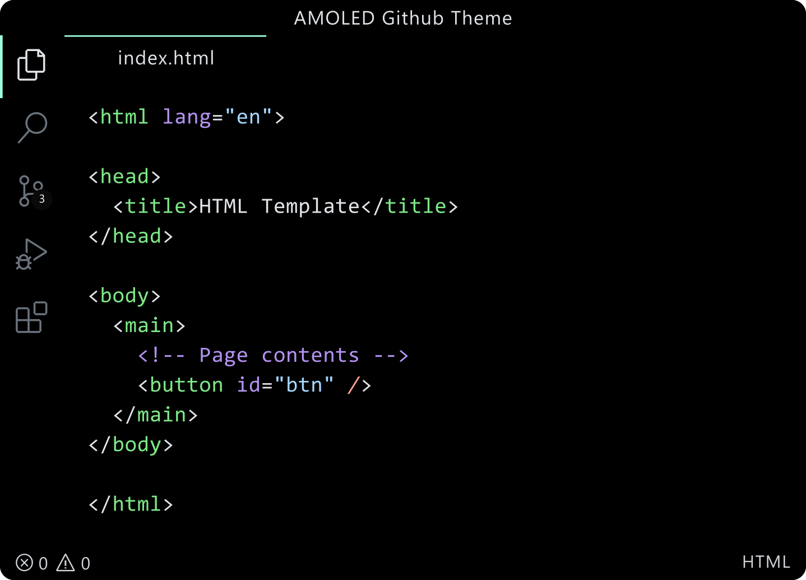

<h3 id="css">CSS</h3>

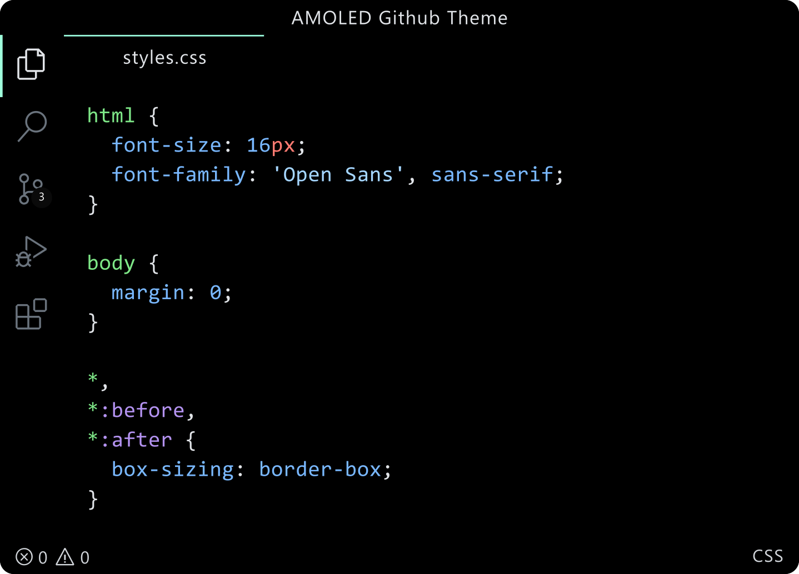

<h3 id="js">JS</h3>

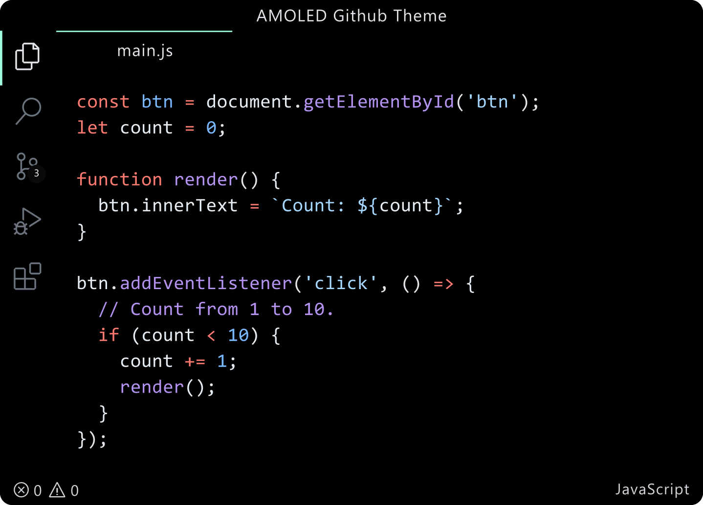

<h3 id="python">Python</h3>

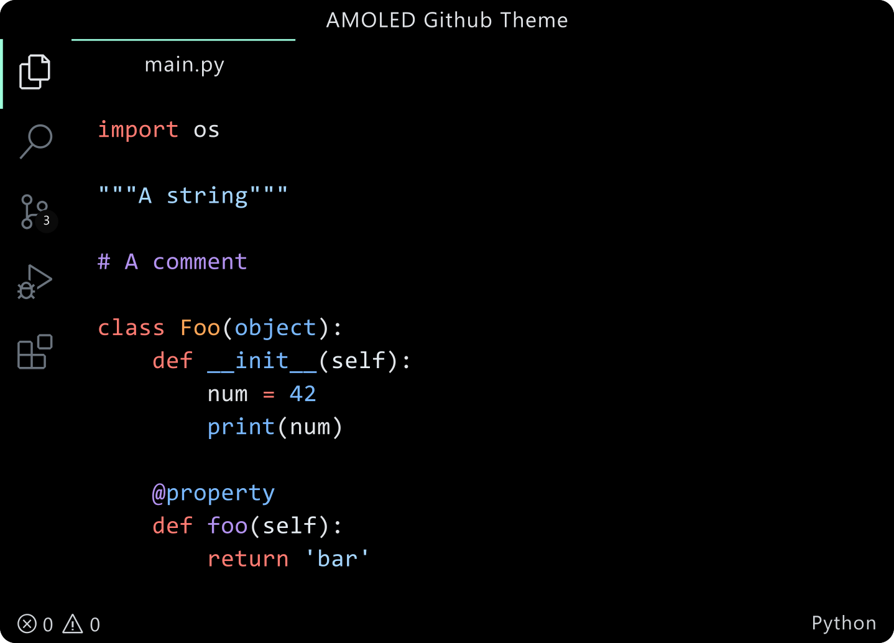

<h3 id="java">Java</h3>

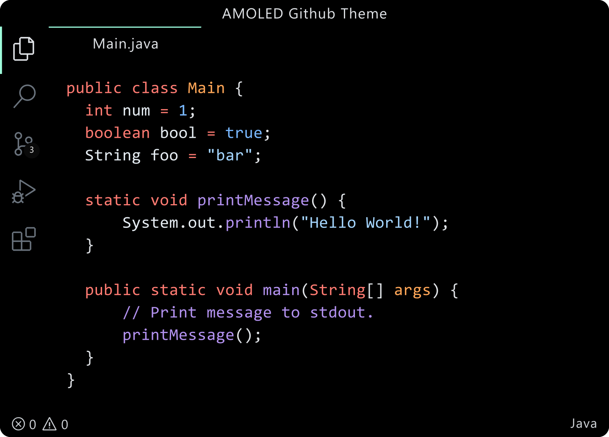

<h3 id="go">Go</h3>

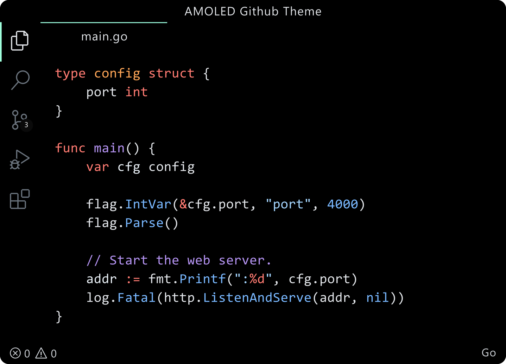

<h3 id="c">C++</h3>

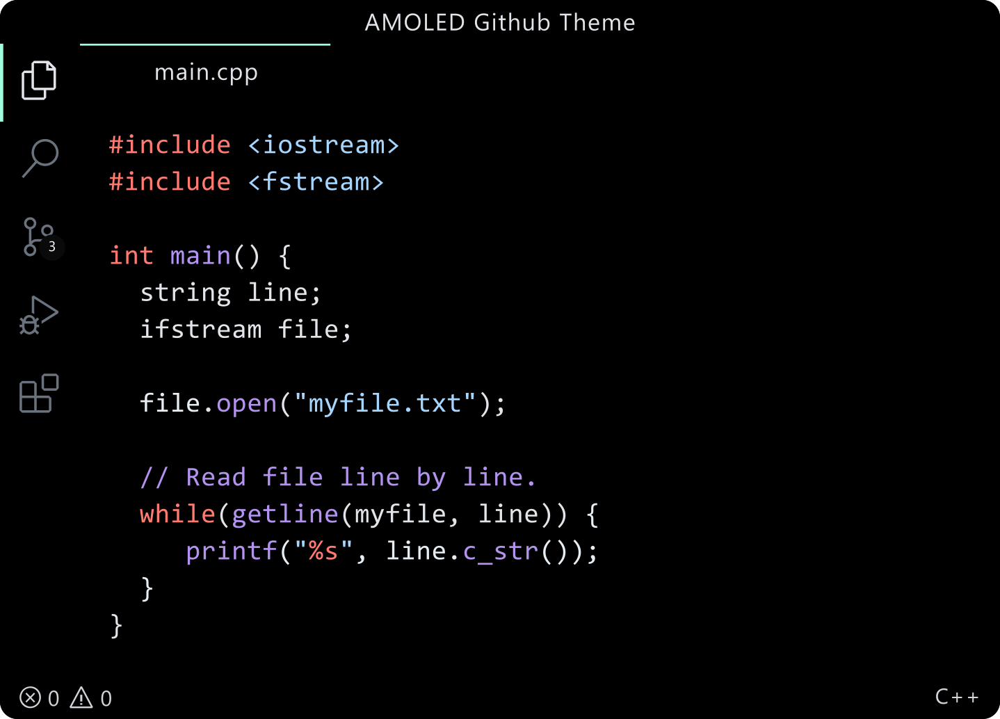

<h3 id="rust">Rust</h3>

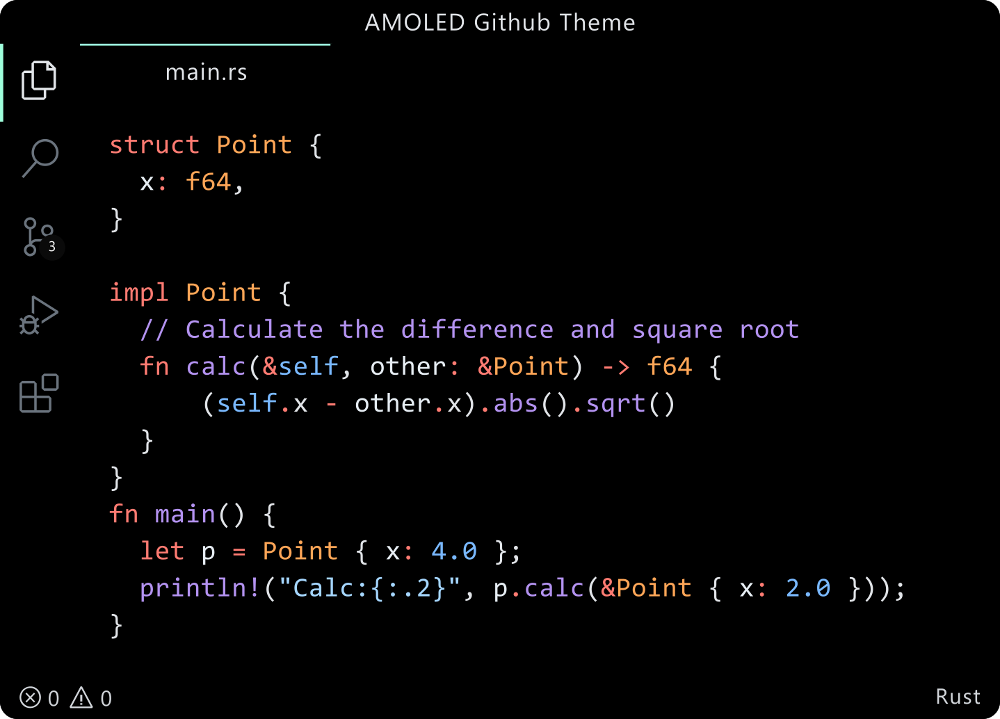

<h3 id="ruby">Ruby</h3>

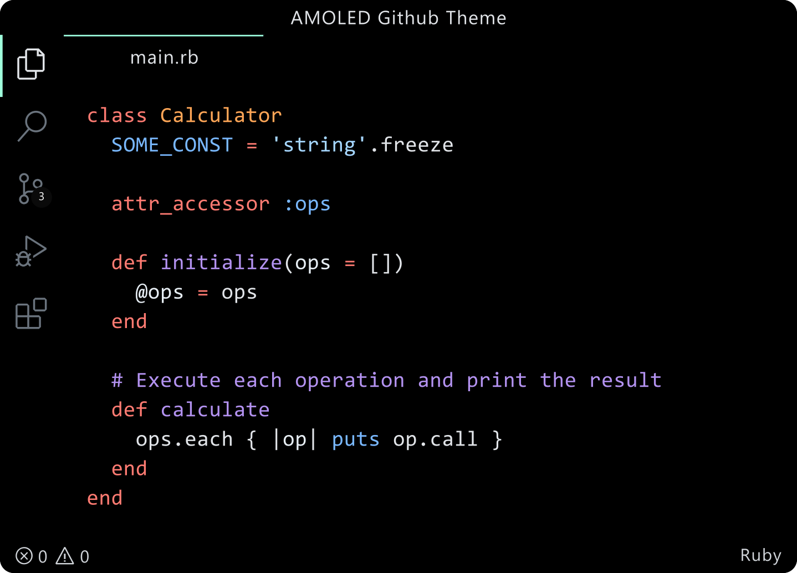

<h3 id="php">PHP</h3>

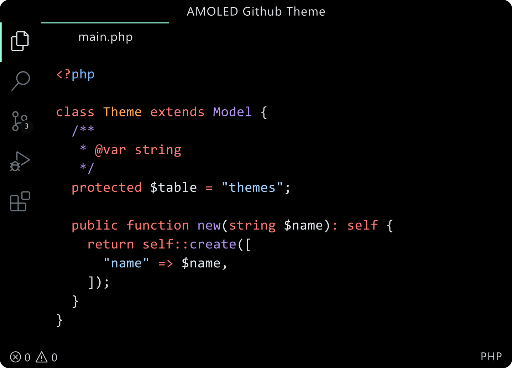

<h2 id="php">Full Desktop</h3>

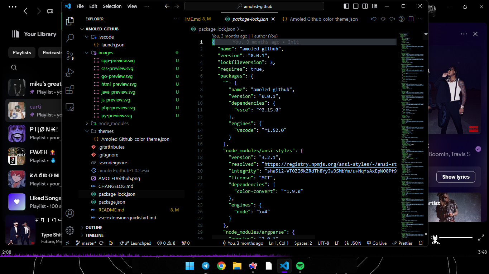

